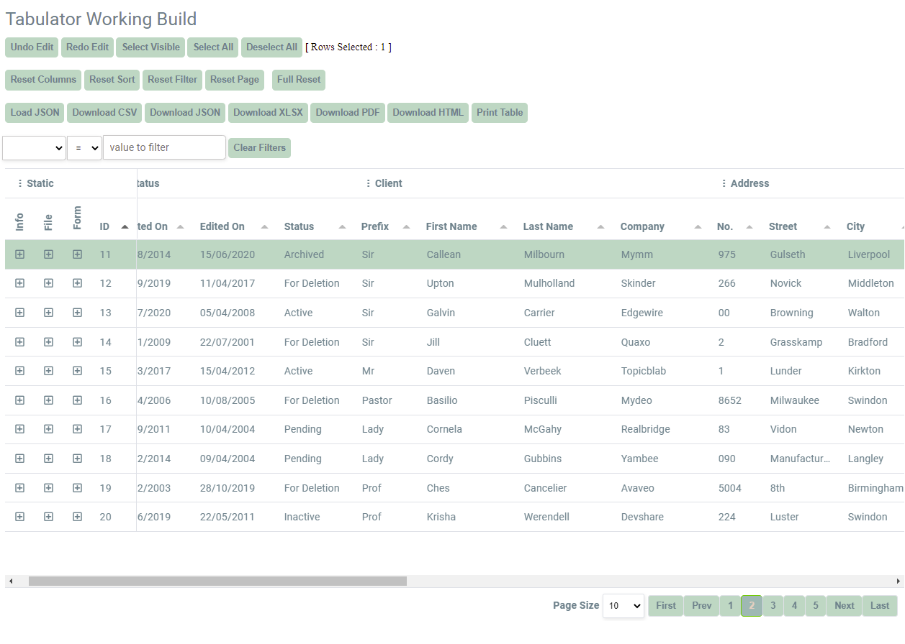
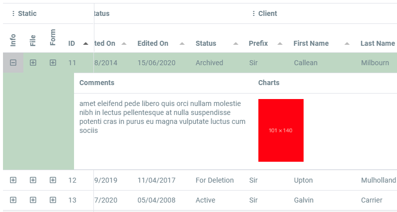
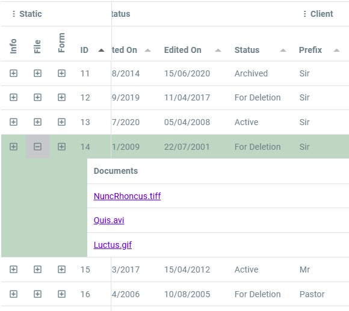
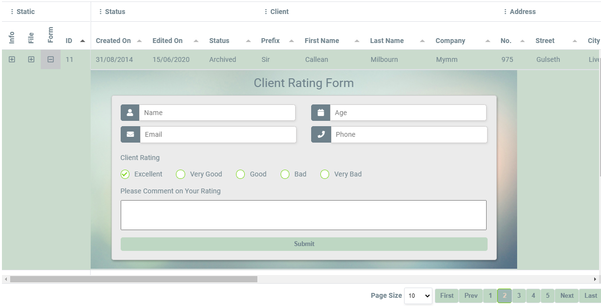

# Tabulator-API

## A Better Example with added features.

Complete with the Serverside api to MongoDB

Dropdown Comments, File Links, or Whole Forms

Setup for local file, but can also use an API.

First Four Columns are Frozen.

### Dropdown Form

Visit this link to try it out:

[https://avertry.github.io/Tabulator-API/](https://avertry.github.io/Tabulator-API/)

See Update Log for recent changes.
